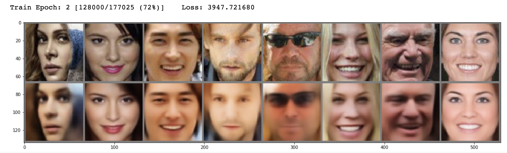
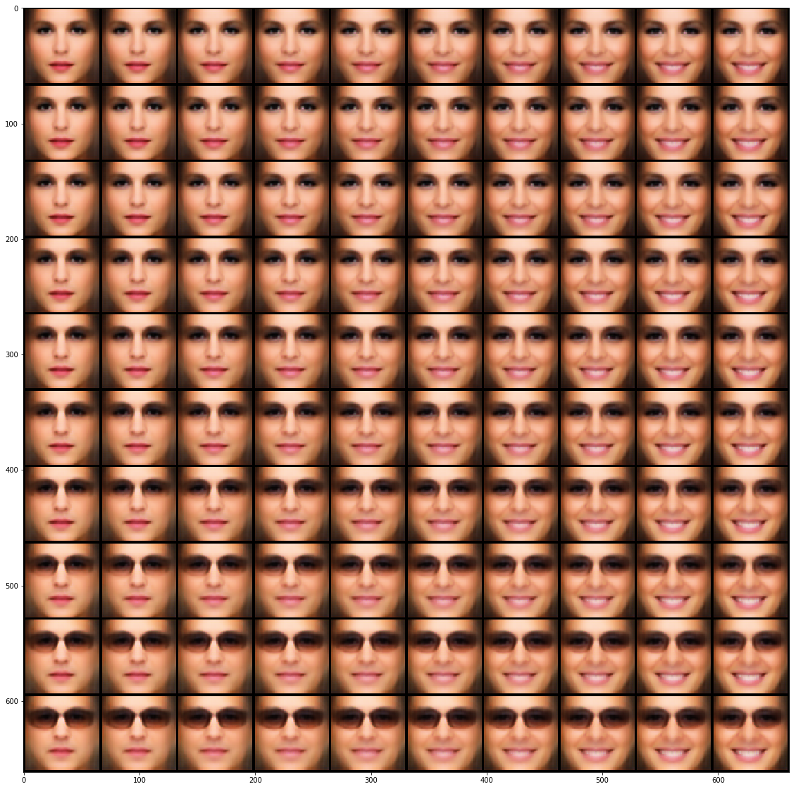

# Experimenting with Simple CNN Variational Auto-Encoders

This repo contains single notebook containing code for training 
and playing with simple Convolutional Variational Auto-Encoders. 

Experiments are done on face-aligned and face-cropped MS Celebrity face dataset.

VGG16 is used for perceptual loss and transposed convolution as well as subpixel convolution
(pixel shuffle) can be tried out for training. 

References: 
https://arxiv.org/abs/1312.6114 
https://arxiv.org/abs/1610.00291 
https://arxiv.org/pdf/1707.02937 
https://www.microsoft.com/en-us/research/project/ms-celeb-1m-challenge-recognizing-one-million-celebrities-real-world/

Visualization of reconstruction results on small test set.

Visualization of continuous 2D latent space with basis vectors being "Smile" and "Eyeglasses". 

